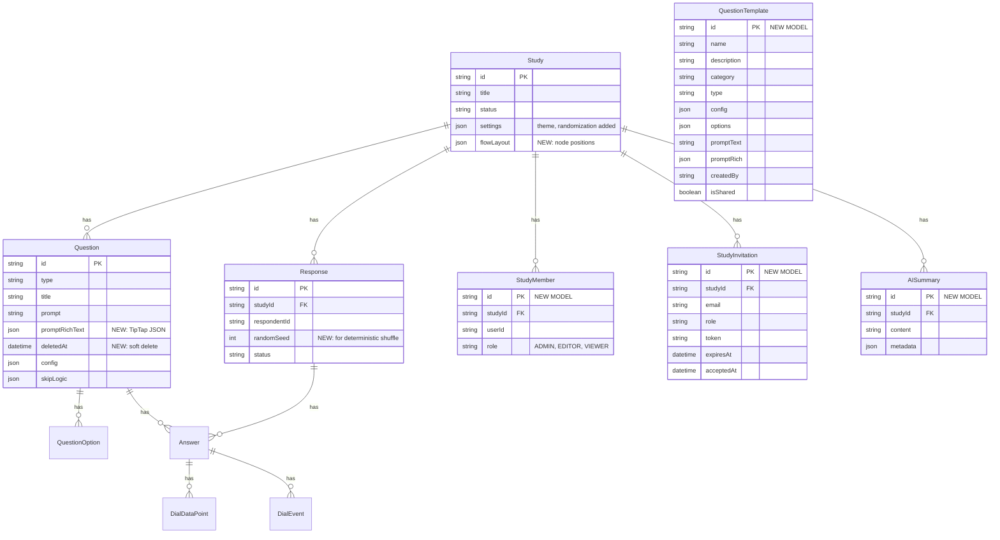

# Storyline Studio V2: Best-in-Class Platform Upgrade

## Overview

Transform Storyline Studio from a functional Phase 1 MVP into an industry-leading survey and content assessment platform that commands premium positioning when used with clients like Google and YouTube. The V2 upgrade focuses on three pillars: (1) a revolutionary editor experience that makes Qualtrics and Typeform feel dated, (2) survey respondent polish that feels crafted and premium, and (3) intelligent analytics that leverage AI to surface insights humans would miss.

**Design north star**: The platform should feel like it was designed by a studio, not cobbled together by developers. Every interaction — from dragging a question node to watching a dial chart animate — should feel intentional, smooth, and premium. Think Notion's editing fluidity meets Linear's visual polish meets Figma's spatial canvas.

## Problem Statement

Phase 1 delivered a working platform with solid architecture (11 question types, video dial testing, skip logic, results dashboard, security). But the editing experience feels like a form builder from 2018:

- Questions live in a flat vertical list — no visual representation of survey flow or branching
- No inline preview — admins edit blind, then switch to a separate preview
- Plain text only — no formatting in question prompts
- No undo/redo — mistakes require manual reversal
- No keyboard shortcuts — everything requires mouse clicks
- No question templates or cross-study reuse
- Results lack AI-powered insights and real-time monitoring
- No multi-user collaboration or version history
- Survey appearance is fixed — no per-study branding

When Josh demos this to a Google or YouTube executive, it needs to feel like a $50K+ tool, not a prototype.

## Technical Foundation (Current State)

**Stack**: Next.js 16 (App Router), React 19, TypeScript strict, Prisma 7, Supabase Auth, PostgreSQL, Cloudflare R2, Tailwind 4 + shadcn/ui v4, Vercel

**Key architecture facts from codebase review:**
- State management: Pure `useState` + props drilling (3 levels max). No stores, no reducers, no contexts (except Toast).
- Animations: CSS-only via `tw-animate-css` + custom keyframes. No Framer Motion.
- Rich text: None. All prompts are plain `<input>` / `<textarea>`.
- Charting: Hand-built SVG/Canvas in `QuestionResults.tsx` (~1400 lines). No charting library.
- Testing: Zero tests. No test config, no test scripts.
- Keyboard shortcuts: Ad-hoc only (Escape to close modals).
- Realtime: Supabase Realtime is not used despite being in the stack.
- Git: No remote, no CI/CD.
- Fonts: Scto Grotesk A (.woff), Items (.woff2), Phonic Mono (.woff2) — self-hosted via `next/font/local`.

**Key files:**
- Editor: `app/src/app/(admin)/admin/studies/[id]/edit/components/StudyEditor.tsx` (list + DnD)
- Question editor: `QuestionEditor.tsx` (1054 lines, type-specific configs inline)
- Survey runner: `app/src/app/(survey)/survey/[id]/components/SurveyShell.tsx`
- Question renderer: `QuestionRenderer.tsx` (lazy-loads 10 type components)
- Results: `QuestionResults.tsx` (~1400 lines, all visualizations)
- Aggregation: `app/src/lib/aggregation.ts` (516 lines)
- Schema: `app/prisma/schema.prisma` (10 models, 291 lines)

**Phase 1 learnings from `docs/solutions/`:**
- R2 key storage: Use `.string()` not `.url()` in Zod validators for R2 keys
- CSP management: Must proactively update `next.config.ts` when adding external domains
- Admin vs respondent signing: Separate code paths for media URL signing
- Preview system: `?preview=true` bypasses status checks, uses `QuestionRenderer` directly

## Proposed Solution

### Architecture Decisions

**Decision 1: Zustand for editor state management**
The editor currently uses prop-drilling through 3 component levels. With undo/redo, autosave, multi-panel views, and flow builder state, this will not scale. Zustand is the right fit: lightweight (~1KB), works with React 19, supports middleware (undo/redo via `temporal`), and doesn't require providers/contexts.

**Decision 2: TipTap for rich text editing**
TipTap (ProseMirror-based) is the best React/TypeScript rich text editor in 2026. It supports collaborative editing (Yjs), has excellent extensibility, renders to JSON (not raw HTML — safer for XSS), and has a mature ecosystem. Store TipTap JSON in the existing `prompt` field (rename to `promptJson` for rich text, keep `prompt` for plain text backward compat).

**Decision 3: React Flow for visual flow builder**
React Flow (xyflow) is the standard React node graph library. It handles zoom, pan, minimap, edge drawing, keyboard navigation, and auto-layout. ~45KB gzipped but admin-only (not in survey bundle). Store node positions in a new `flowLayout` JSONB field on Study.

**Decision 4: Client-side undo with debounced server sync**
Undo/redo operates on a client-side history stack (via Zustand temporal middleware). Changes are debounced to the server every 1.5 seconds. Deleted questions are soft-deleted (`deletedAt` column) so undo can restore them within a session. History resets on page navigation.

**Decision 5: CSS custom properties for theme engine**
Survey themes are applied via CSS custom properties (`--survey-primary`, `--survey-bg`, etc.) injected into the survey layout. This isolates theme styles from the admin UI, requires zero JavaScript runtime cost, and works with Tailwind's `theme()` function.

**Decision 6: Anthropic Claude API for AI analytics**
Use Claude for executive summary generation and insight detection. Only send aggregate data (counts, percentages, means) — never raw open-text responses containing potential PII. On-demand generation with cached results.

**Decision 7: Supabase Realtime for live monitoring**
Subscribe to `Response` table inserts/updates via Supabase Realtime channels. Debounce chart updates to every 5 seconds to prevent render thrashing during high-volume collection.

---

## Implementation Phases

### Phase 2a: Editor Revolution (The Money Phase)

**Goal**: Make the editor the #1 thing that impresses clients in a demo. When Josh opens the editor, it should feel like opening Figma — spatial, fluid, powerful.

**Duration**: 8-10 days

---

#### 2a.0: Prerequisites (CI, Types, Bug Fixes, Shared Components)

**Why first**: These are foundational fixes and setup that every subsequent task depends on. Skipping these creates compounding technical debt.

**Tasks:**

- [ ] **CI/testing setup**: Create GitHub remote repo, configure GitHub Actions (type-check + lint + build on PR), install Vitest + testing-library
- [ ] **Extract canonical types from Prisma**: Create `lib/types/study.ts`, `lib/types/question.ts` — eliminate duplicate type definitions across editor/survey/results before adding Zustand
- [ ] **Fix `Record<string, ...>` type gaps**: `configSchemaByType` in `question.ts` should use `QuestionType` as key, not `string`; `answerSchemaByType` in `answer.ts` same fix; `VALID_TRANSITIONS` in `study.ts` should be `Record<StudyStatus, readonly StudyStatus[]>`
- [ ] **Fix existing bugs before V2 amplifies them**:
  - `VideoDial.tsx` line 79: `isBuffering` React state used as synchronous gate — use `useRef` for buffering (Race 3 from batch2)
  - `VideoDial.tsx` lines 64-74: Signed URL fetch has no AbortController — causes unmount leak
  - `VideoDial.tsx` line 86: `isBuffering` in dependency array causes unnecessary callback recreation — remove with ref fix
  - `DialSlider.tsx` line 23: `value` in `getValueFromPosition` dependency array causes unnecessary recreation — stabilize callback identity
  - `StudyEditor.tsx` line 119: `handleDragEnd` fires unguarded reorder fetch — two rapid drags race; add AbortController or sequence counter
- [ ] **Move `QuestionRenderer` to shared location**: Relocate from `(survey)/` route group to `src/components/survey/` so admin `LivePreview` can import it without breaking bundle isolation (anti-pattern D from batch2)

**Acceptance criteria:**
- [ ] GitHub Actions CI runs type-check + lint + build on every PR
- [ ] Vitest is installed and configured with at least one passing test
- [ ] Canonical types extracted from Prisma; no duplicate type definitions
- [ ] All 5 existing bugs fixed with tests
- [ ] `QuestionRenderer` importable from both `(admin)` and `(survey)` route groups

---

#### 2a.1: Editor State Foundation (Zustand + Autosave)

**Why first**: Every subsequent editor feature depends on centralized state management.

**Tasks:**

- [ ] Install Zustand and `zundo` (temporal middleware for undo/redo)
- [ ] Create `app/src/stores/editor-store.ts` with the following state shape:

```typescript
// app/src/stores/editor-store.ts
interface EditorState {
  study: StudyData | null
  questions: QuestionData[]
  selectedQuestionId: string | null
  editorView: 'list' | 'flow'
  isDirty: boolean
  isSaving: boolean
  lastSavedAt: Date | null

  // Actions
  setStudy: (study: StudyData) => void
  selectQuestion: (id: string | null) => void
  updateQuestion: (id: string, patch: Partial<QuestionData>) => void
  addQuestion: (question: QuestionData) => void
  deleteQuestion: (id: string) => void
  reorderQuestions: (ids: string[]) => void
  duplicateQuestion: (id: string) => void
  setEditorView: (view: 'list' | 'flow') => void
}
```

- [ ] Wrap with `temporal` middleware for automatic undo/redo history
- [ ] Implement debounced autosave (1.5s after last change) that syncs dirty state to server
- [ ] Add save indicator in editor header: "Saving..." / "Saved" / "Unsaved changes"
- [ ] Migrate `StudyEditor.tsx` from `useState` to Zustand store
- [ ] Migrate `QuestionEditor.tsx` from local state + explicit save to store-driven
- [ ] Add soft-delete: Prisma migration to add `deletedAt DateTime?` to Question model
- [ ] Update all question queries to filter `WHERE deletedAt IS NULL`
- [ ] Delete API marks `deletedAt` instead of hard delete; add permanent purge after 30 days

**Schema changes:**

```prisma
// Addition to Question model
model Question {
  // ... existing fields
  deletedAt  DateTime?
}

// Addition to Study model
model Study {
  // ... existing fields
  flowLayout Json?  // { nodes: { [questionId]: { x, y } } }
}
```

**Acceptance criteria:**
- [ ] All editor state flows through Zustand store
- [ ] Autosave indicator shows current save state
- [ ] Changes persist without explicit "Save" button clicks
- [ ] Deleted questions can be restored via undo within session

> **Deep research notes:**
>
> **Store design (batch2 §1a, §1b):** Use a discriminated `EditorState` union pattern — `{ status: 'loading' } | { status: 'ready'; study: StudyData; ... }` — to eliminate null checks on `study`. Separate `EditorData` (tracked state) from `EditorActions` (functions) as distinct interfaces; combine as `EditorStore = EditorData & EditorActions`. This prevents zundo from serializing function references into history snapshots.
>
> **Zustand organization (batch3 §3):** Use the slices pattern for code organization while keeping a single store (e.g., `slices/questions.ts`, `slices/study.ts`, `slices/ui.ts`). Use `partialize` in temporal config to exclude UI state (`selectedQuestionId`, `isSaving`, `isDirty`, `lastSavedAt`, `editorView`, drag state) from undo history. Use `handleSet` with `lodash.throttle` at 1000ms to prevent keystroke-level history spam. Set `limit: 50` on temporal middleware (at 50 questions x ~2KB each, 50 snapshots = ~5MB; unlimited grows unboundedly).
>
> **Alternative (simplicity review, batch1):** Drop zundo entirely. Full undo history is over-engineered for a form editor. An "undo last delete" toast that cancels the deletion within the debounce window covers 95% of the need.
>
> **Hydration pattern (batch1, batch3):** Server Component fetches study data, passes to a thin Client Component that calls `setState` on mount. No async actions for initial load.
>
> **Autosave failure handling (batch3 §3):** Retry on 5xx with exponential backoff (3 retries). Do NOT retry on 4xx — surface as inline errors. The client is the source of truth during editing; server rejections should NOT cause automatic state reversals.
>
> **Save-on-exit (batch2 §6C, batch3 §3):** Call `debouncedSave.flush()` on view switch (list <-> flow) and `beforeunload`. Without this, changes are lost if debounce hasn't fired before navigation.
>
> **Race conditions (batch2 §4):**
> - *Race 1 (autosave vs undo clobber)*: Debounced save captures pre-undo state in closure. Fix: read state at fire time (not schedule time), cancel pending debounce on undo, use AbortController for in-flight requests.
> - *Race 2 (Cmd+Z during in-flight save)*: Save resolves and clears `isDirty` even though store no longer matches server. Fix: version counter on state — increment on every mutation; on save resolve, only clear `isDirty` if version matches.
>
> **State machine (batch2 §6A):** Define `editorMode: 'IDLE' | 'SAVING' | 'DRAGGING' | 'UNDOING'` in store. Gate mutations by mode to prevent boolean soup (`isSaving && isDragging && isPasting`).
>
> **Type safety (batch2 §1c, §1f):** Use discriminated `QuestionConfig` by type (not flat bag of optionals) — `TypedQuestionData<T>` with `config: QuestionConfigByType[T]`. Fix existing `Record<string, ...>` gaps in schemas (see 2a.0).
>
> **Soft-delete constraint (batch1):** Adding `deletedAt` breaks the existing `@@unique([studyId, order])` constraint. Need a partial unique index `WHERE deletedAt IS NULL` or redesign ordering.

---

#### 2a.2: Undo/Redo + Keyboard Shortcuts

**Tasks:**

- [ ] Wire `zundo` temporal middleware to capture all state mutations
- [ ] Add keyboard listener layer: `app/src/hooks/use-keyboard-shortcuts.ts`

```typescript
// app/src/hooks/use-keyboard-shortcuts.ts
const SHORTCUTS = {
  'mod+z': undo,
  'mod+shift+z': redo,
  'mod+s': forceSave,
  'mod+d': duplicateSelected,
  'mod+n': addNewQuestion,
  'mod+backspace': deleteSelected,
  'escape': deselectQuestion,
  'mod+p': togglePreview,
  'ArrowUp': selectPreviousQuestion,  // when no input focused
  'ArrowDown': selectNextQuestion,
} as const
```

- [ ] Add keyboard shortcut hints to buttons/tooltips throughout editor
- [ ] Add command palette (Cmd+K) with searchable actions list
- [ ] Build `app/src/components/ui/command-palette.tsx` using shadcn Command component

**Acceptance criteria:**
- [ ] Cmd+Z undoes last action, Cmd+Shift+Z redoes
- [ ] Cmd+K opens command palette with all editor actions
- [ ] All shortcuts shown in tooltips on hover
- [ ] Shortcuts disabled when typing in text inputs (no accidental triggers)

> **Deep research notes:**
>
> **Library (batch3 §3):** Use `react-hotkeys-hook` (~2KB) instead of raw `useEffect` with `keydown`. It handles focus scope, input element detection, modifier normalization, and cleanup. Build an `EditorKeyboardShortcuts` component inside `StudyEditor` layout that renders nothing, just registers shortcuts.
>
> **Focus behavior (batch3 §3):** `mod+z` / `mod+shift+z` must NOT fire when focus is in `<input>` / `<textarea>` — browser handles text undo there. `react-hotkeys-hook` does this by default. However, `mod+s` SHOULD fire even from inputs — use `enableOnFormTags: true` for save.
>
> **Command palette (simplicity review, batch1):** Cut entirely. 5-15 question surveys do not need Cmd+K. Scope shortcuts to: Cmd+Z (undo delete), Cmd+S (force save), Cmd+D (duplicate), Escape (deselect), Arrow Up/Down (navigate questions).

---

#### 2a.3: Split-Pane Editor with Live Preview

**Why**: The single biggest UX improvement. Admins currently edit blind.

**Tasks:**

- [ ] Redesign editor layout as resizable split-pane:
  - Left panel: question list/flow (collapsible)
  - Center panel: question editor (primary workspace)
  - Right panel: live respondent preview (collapsible, toggleable)
- [ ] Build `app/src/app/(admin)/admin/studies/[id]/edit/components/EditorLayout.tsx`:
  - Resizable panels via CSS `resize` or a lightweight splitter
  - Panel collapse/expand with smooth animation
  - Panel size persisted to localStorage
  - Responsive: panels stack vertically on narrow screens
- [ ] Build `app/src/app/(admin)/admin/studies/[id]/edit/components/LivePreview.tsx`:
  - Renders `QuestionRenderer` with current question data from store
  - Scales to fit panel width (CSS transform scale)
  - Shows device frame selector: mobile (375px) / tablet (768px) / desktop (1024px)
  - Updates in real-time as admin types (no debounce on preview, only on save)
  - Apply study theme if configured
- [ ] Add "Preview entire survey" button that opens full SurveyShell in preview panel

**Acceptance criteria:**
- [ ] Admins see exactly what respondents see, updating as they type
- [ ] Device frame toggle shows mobile/tablet/desktop preview
- [ ] Panel sizes are remembered across sessions
- [ ] Preview renders all 11 question types correctly

> **Deep research notes:**
>
> **Cross-route import (batch2 §3D):** `QuestionRenderer` is in the `(survey)/` route group; admin `LivePreview` cannot import it without breaking bundle isolation. Move to shared `src/components/survey/` location (see 2a.0 prerequisite).
>
> **Error boundary (batch1, batch4):** Wrap the LivePreview component in an `ErrorBoundary` with fallback UI. A crash in the preview panel should not take down the editor.
>
> **Decomposition (batch2 §3E):** Decompose from the start — do NOT build a monolithic `EditorLayout.tsx`. Create separate `PanelResizer.tsx`, `CollapsiblePanel.tsx`, and `EditorLayout.tsx` as a thin composition layer.
>
> **Design details (batch4 §3):** Avoid visible panel borders; use shadow-based separation with a 1px splitter that reveals on hover (Storyline Blue on drag). Panel headers use Phonic Mono uppercase labels ("QUESTIONS", "EDITOR", "PREVIEW"). Preview panel should have a device frame with layered box-shadow (floating artifact feel), plus a segmented control for Mobile/Tablet/Desktop with sliding indicator. Panel minimums: left 240px, center 400px, right 320px. Collapse animation: `width 350ms cubic-bezier(0.32, 0.72, 0, 1)`, collapsed to 44px icon rail.

---

#### 2a.4: Rich Text Question Editing

**Tasks:**

- [ ] Install TipTap core + extensions: `@tiptap/react`, `@tiptap/starter-kit`, `@tiptap/extension-link`, `@tiptap/extension-image`, `@tiptap/extension-placeholder`
- [ ] Create `app/src/components/editor/RichTextEditor.tsx`:
  - Floating toolbar (appears on text selection) with: Bold, Italic, Link
  - Fixed toolbar above editor with: Bold, Italic, Link, Image, Clear formatting
  - Placeholder text support
  - TipTap JSON output (not HTML)
  - Tailwind-styled content area matching brand typography
- [ ] Create `app/src/components/survey/RichTextRenderer.tsx`:
  - Renders TipTap JSON to React elements (not dangerouslySetInnerHTML)
  - Lightweight: only the renderer, not the full editor (~5KB vs ~45KB)
  - Sanitizes output (no script tags, no on* handlers)
  - Used on respondent side in `QuestionRenderer`
- [ ] Prisma migration: add `promptRichText Json?` to Question model
  - Keep existing `prompt` field for backward compatibility and plain-text search
  - When `promptRichText` is set, renderer uses it; otherwise falls back to `prompt`
- [ ] Update `QuestionEditor.tsx` to use `RichTextEditor` for prompt field
- [ ] Update `QuestionRenderer.tsx` to use `RichTextRenderer` when `promptRichText` exists
- [ ] Handle images in rich text: upload to R2 via existing `/api/upload` endpoint, store as R2 key in TipTap image node, sign URLs at render time
- [ ] Update CSP in `next.config.ts` for any TipTap CDN resources (if needed)

**Schema changes:**

```prisma
model Question {
  // ... existing fields
  promptRichText Json?  // TipTap JSON document
}
```

**Acceptance criteria:**
- [ ] Admins can bold, italicize, link, and embed images in question prompts
- [ ] Rich text renders correctly on respondent side
- [ ] Survey bundle impact is under 8KB for the renderer
- [ ] Existing plain-text prompts continue to work (backward compatible)
- [ ] No XSS vectors in rendered rich text

> **Deep research notes:**
>
> **React 19 compatibility (batch3 §2):** TipTap v3.20+ required — v2 has a blocking React 19 incompatibility with `tippyjs-react`.
>
> **Bundle (batch3 §2):** Do NOT use `@tiptap/starter-kit` — it includes 16+ extensions (blockquote, code-block, heading, bullet-list, etc.) unnecessary for survey prompts. Cherry-pick individual extensions: `@tiptap/extension-document`, `-paragraph`, `-text`, `-bold`, `-italic`, `-link`, `-image`, `-history`, `-placeholder`, `-bubble-menu`. This saves 30-40% on admin bundle.
>
> **XSS (batch3 §2, batch4 §1):** CVE-2025-14284 in `@tiptap/extension-link` — case-sensitive `javascript:` bypass. Always sanitize URLs independently with a `sanitizeUrl()` function that checks against allowed protocols (`https:`, `http:` only). Validate TipTap JSON server-side against an allowlist of node types (`doc`, `paragraph`, `text`, `image`) and mark types (`bold`, `italic`, `link`). Reject unknown types. The renderer must use an explicit node-type allowlist; unknown types render `null`.
>
> **Toolbar (batch3 §2):** Use `BubbleMenu` (floating toolbar on text selection), not a fixed toolbar. Matches Notion/Linear UX and saves vertical space.
>
> **Survey-side renderer (batch3 §2, batch4 §2):** Use `@tiptap/static-renderer/json/html` (the `json` namespace has zero ProseMirror dependency, ~3-4KB gzipped). Alternatively, write a custom ~50-line recursive JSON-to-React walker for ~1-2KB. Do NOT import any `@tiptap/*` packages on the survey side.
>
> **Search/indexing (batch3 §2):** Add a `promptPlain` field alongside `promptRichText` — needed for full-text search, screen readers, and notifications.
>
> **IME race condition (batch2 §4, Race 9):** Check `editor.view.composing` before syncing to Zustand. During CJK/autocorrect composition, the debounce could fire with intermediate JSON state.
>
> **Simplicity review alternative (batch1):** Skip TipTap entirely. Bold/italic/link does not require ProseMirror. Use markdown rendering instead (~20 lines: `**bold**`, `*italic*`, `[link](url)`). No new DB column, no new dependency. TipTap can be added later if clients demand inline images in prompts.

---

#### 2a.5: Visual Flow Builder

**Why**: The showpiece feature. When Josh shows a client the survey flow as a visual graph with branching logic, it immediately communicates sophistication.

**Tasks:**

- [ ] Install React Flow: `@xyflow/react`
- [ ] Create `app/src/app/(admin)/admin/studies/[id]/edit/components/FlowBuilder.tsx`:
  - Each question renders as a custom node with: type icon, title (truncated), phase badge, required indicator
  - Skip logic rules render as labeled edges between nodes
  - Auto-layout algorithm (dagre/elkjs) for initial positioning
  - Manual drag to reposition nodes (positions saved to `Study.flowLayout`)
  - Minimap in bottom-right corner
  - Zoom controls + fit-to-view button
  - Background grid with subtle dot pattern
- [ ] Create custom node component `app/src/app/(admin)/admin/studies/[id]/edit/components/FlowNode.tsx`:
  - Compact card showing: question number, type icon, title preview
  - Phase-colored left border (matching existing phase colors)
  - Selection state with primary color ring
  - Source handle (bottom) and target handle (top) for edge connections
  - Expand on click to show full question editor in side panel
- [ ] Create custom edge component for skip logic visualization:
  - Labeled with condition text (e.g., "If 'Yes'")
  - Animated dash pattern for skip-to connections
  - Different edge styles: normal flow (solid gray) vs skip logic (dashed primary)
  - Delete button on hover
- [ ] Implement edge creation for skip logic:
  - Drag from source handle → target handle opens skip logic rule builder
  - Rule builder: select condition (question, operator, value) → creates SkipLogicRule
  - Edge updates when skip logic rule changes
- [ ] Add view toggle in editor header: List View | Flow View (with icons)
  - Both views share the same Zustand store
  - Switching views preserves selection state
  - Flow view positions auto-generated for studies without saved layout
- [ ] Handle edge cases:
  - Questions with no skip logic show only sequential flow edges
  - Terminal actions (screen out) render as special end nodes
  - Phase boundaries shown as horizontal swim lanes or color regions

**Acceptance criteria:**
- [ ] Survey displays as a connected node graph
- [ ] Skip logic is visible as labeled edges between nodes
- [ ] Admins can draw new skip logic connections by dragging between nodes
- [ ] Node positions persist across sessions
- [ ] Auto-layout produces readable graphs for up to 50 questions
- [ ] Flow builder is admin-bundle only (zero impact on survey bundle)

> **Deep research notes:**
>
> **Performance (batch3 §1):** Define `nodeTypes` and `edgeTypes` outside components as module-level constants — NOT inline. Inline definition causes React Flow to unmount/remount all nodes on every render. This is the #1 performance mistake with React Flow. Wrap all custom node and edge components in `React.memo`.
>
> **Controlled mode (batch1, batch3 §1):** Use controlled mode: Zustand is source of truth, React Flow is derived view. Do not let React Flow maintain its own copy of node state — this creates a dual-state synchronization problem.
>
> **Lazy loading (batch3 §1, batch4 §2):** Lazy-load with `next/dynamic` `ssr: false`. Only load when user switches to Flow View, not on editor mount. ~45KB gzipped for React Flow alone.
>
> **Auto-layout (batch3 §1):** Use `@dagrejs/dagre` (~40KB) for auto-layout, NOT ELK (1.5MB — overkill for a DAG). Dagre returns center coordinates but React Flow uses top-left positioning — subtract `width/2` and `height/2` from dagre output.
>
> **v12 breaking change (batch3 §1):** Node dimensions now live at `node.measured.width` / `node.measured.height`, not in the node object directly. Layout functions must use `node.measured` values.
>
> **Mobile (batch3 §1):** Desktop/tablet only. Show list fallback on mobile (`< 768px`). `panOnDrag: false` combined with `panOnScroll: true` breaks touch scrolling.
>
> **Design details (batch4 §3):** Custom cross-hatch grid background (not dots) — `linear-gradient` in both directions, 24px spacing, navy-tinted at 3% opacity. Node cards: 220px wide, 10px border-radius, phase color bar (3px) at top, type icon + question number + title (2-line clamp) + type pill. Phase swim lanes as semi-transparent colored regions with dashed border and Phonic Mono labels. Custom branded zoom controls replacing React Flow defaults (compact button group, bottom-left).
>
> **Simplicity review alternative (batch1):** Cut the flow builder entirely. 5-30 question surveys do not need a node graph. The list editor with DnD is the correct UI for this scale. The controlled-mode complexity confirms it is too much machinery. This is the strongest "cut" recommendation from the simplicity review.

---

#### 2a.6: Question Management (Copy, Duplicate, Templates, Bulk)

**Tasks:**

- [ ] **Duplicate question** (within study):
  - "Duplicate" button on each question card + Cmd+D shortcut
  - Creates copy with "(Copy)" suffix, placed after original
  - Copies all config, options, media references (not media files)
  - Does NOT copy skip logic (references would be wrong)

- [ ] **Copy/paste across studies**:
  - "Copy to clipboard" serializes question to JSON in clipboard
  - "Paste" in another study's editor deserializes and creates new question
  - Uses `navigator.clipboard` API with JSON MIME type

- [ ] **Question templates**:
  - Prisma migration: new `QuestionTemplate` model

```prisma
model QuestionTemplate {
  id          String   @id @default(uuid())
  name        String
  description String?
  category    String?  // e.g., "NPS", "Demographics", "Video Dial"
  type        QuestionType
  config      Json
  options     Json     // serialized QuestionOption[]
  promptText  String?
  promptRich  Json?
  createdBy   String
  isShared    Boolean  @default(false)
  createdAt   DateTime @default(now())
  updatedAt   DateTime @updatedAt

  @@index([createdBy])
  @@index([isShared])
  @@index([type])
}
```

  - "Save as Template" action on any question → dialog with name/category/description
  - "Add from Template" in question type selector → template browser with search/filter
  - Seed with 10-15 common templates: NPS, CSAT, demographics, pre/post awareness, etc.

- [ ] **Bulk editing**:
  - Shift+click or checkbox to multi-select questions in list view
  - Bulk action bar appears: "Change Phase", "Toggle Required", "Delete Selected"
  - Bulk phase change calls single API endpoint with question IDs + new phase

**Acceptance criteria:**
- [ ] Cmd+D duplicates selected question instantly
- [ ] Question templates can be saved, browsed, and inserted
- [ ] Multi-select + bulk phase change works for 2+ selected questions
- [ ] Cross-study copy/paste works via clipboard

> **Deep research notes:**
>
> **DnD race condition (batch2 §4, Race 12):** Gate keyboard shortcuts while `isDragging` is true. Clipboard paste (Cmd+V) creating a new question mid-drag causes `SortableContext` items to change and indices to break. Reject all list mutations while dragging — this ties into the editor state machine (`IDLE | DRAGGING`) from 2a.1.
>
> **Simplicity review (batch1):** Cut templates, cross-study copy, and bulk edit entirely. Keep only "Duplicate question within study" (Cmd+D). Templates are a low-frequency use case — build when someone asks. Cross-study copy is premature. Bulk editing adds complexity for marginal benefit at 5-30 questions.

---

#### 2a.7: Editor Polish & Refinements

**Tasks:**

- [ ] Extract type-specific config components from `QuestionEditor.tsx` (1054 lines) into separate files:
  - `configs/MultipleChoiceConfig.tsx`
  - `configs/LikertConfig.tsx`
  - `configs/VideoDialConfig.tsx`
  - `configs/MatrixConfig.tsx`
  - `configs/SentimentConfig.tsx`
  - `configs/NumericConfig.tsx`
  - `configs/RankingConfig.tsx`
  - `configs/ABTestConfig.tsx`
  - `configs/ReactionConfig.tsx`
- [ ] Add subtle animations to editor interactions:
  - Question selection: smooth panel slide-in
  - Question add: scale-in animation on new card
  - Question delete: fade-out + collapse animation
  - Drag indicator: smooth ghost preview during DnD
- [ ] Improve DnD experience:
  - Visual insertion indicator (blue line) between questions during drag
  - Cross-phase dragging (auto-changes phase on drop)
  - Keyboard reorder: Alt+Up/Down moves selected question
- [ ] Add "Collapse All" / "Expand All" for question cards
- [ ] Add question search/filter in the sidebar
- [ ] Mobile editor: stack panels vertically, simplified toolbar, bottom sheet for question editing

**Acceptance criteria:**
- [ ] `QuestionEditor.tsx` is under 300 lines after extraction
- [ ] All editor interactions have smooth, purposeful animations
- [ ] Editor is usable (not just visible) on tablet-sized screens

> **Deep research notes:**
>
> **Component registry pattern (batch2 §3F):** Replace scattered `Set` definitions (`LIKERT_TYPES.has(...)`) with a `CONFIG_COMPONENTS: Record<QuestionType, ComponentType<ConfigProps>>` registry. This provides a single lookup for rendering the correct config panel per question type, and TypeScript enforces exhaustiveness — adding a new question type produces a compile error if the registry is not updated.
>
> **Discriminated config (batch2 §1c):** Use discriminated `QuestionConfig` by type (not a flat bag of optionals). Each config component receives only the fields relevant to its question type, making invalid states unrepresentable. `updateQuestion(id, patch: Partial<QuestionData>)` is dangerously loose — type-narrow patches by question type.

---

### Phase 2b: Survey Experience Polish

**Goal**: Make the respondent experience feel premium and delightful. Every transition, every interaction should feel crafted.

**Duration**: 7-9 days

---

#### 2b.1: Delightful Transitions & Animations

**Tasks:**

- [ ] Install Framer Motion: `framer-motion` (admin + survey bundle, but tree-shakeable)
- [ ] Replace `animate-fade-in-up` CSS animation with Framer Motion `AnimatePresence` for question transitions:
  - Forward navigation: current question slides left + fades out, new slides in from right
  - Back navigation: reverse direction
  - Configurable via study settings: `transitionStyle: 'slide' | 'fade' | 'zoom' | 'none'`
- [ ] Add micro-interactions:
  - Option selection: subtle scale bounce (1.0 → 1.02 → 1.0)
  - Button hover: smooth background gradient shift
  - Progress bar: spring physics animation on advance
  - Dial slider: haptic-feel resistance at endpoints (CSS spring)
  - Completion screen: confetti or checkmark draw animation
- [ ] Add page transition wrapper in `SurveyShell`:
  - `layoutId` on question container for smooth layout transitions
  - Exit animation before enter animation (no overlap)
  - Respect `prefers-reduced-motion`
- [ ] Optimize: lazy-load Framer Motion on survey side, ensure total bundle stays under 90KB

**Acceptance criteria:**
- [ ] Question transitions feel smooth and directional (forward/back)
- [ ] Micro-interactions add polish without slowing down navigation
- [ ] `prefers-reduced-motion` disables all animations
- [ ] Survey bundle stays under 90KB total (relaxed from 80KB for animation lib)

> **Deep research notes:**
> - The package formerly known as `framer-motion` was **renamed to `motion`** in late 2024. Install via `npm install motion`, import from `"motion/react"`, not `"framer-motion"`.
> - If using Motion on the survey side: use `LazyMotion` + `domAnimation` + `m` components (~19.6KB gzipped). Use `LazyMotion` + `domMax` on the admin side (required for `layoutId`). Set `MotionConfig reducedMotion="user"` globally. Use `AnimatePresence mode="wait"` for question transitions. Only animate `transform` and `opacity` (compositor-thread properties).
> - **However, both the architecture and simplicity reviews strongly recommend dropping Motion from the survey bundle entirely.** Use CSS transitions + View Transitions API + Web Animations API (`element.animate()`) instead. All described animations (slide, fade, zoom, option bounce, draw-in checkmark) are achievable with CSS. Typeform uses zero animation libraries and achieves ~800ms TTFMP. This saves ~19.6KB from the survey bundle (70KB total vs 88KB).
> - Design details from research: asymmetric slide transition (exit 20%, enter 30%), exit blurs 2px / enter blurs 4px. Fade transition with subtle vertical shift (enter +12px, exit -8px). Zoom from 1.06 scale (enter) to 0.95 (exit). Progress bar with spring physics. Option selection scale bounce `[1, 1.015, 1]` over 200ms. Completion screen draw-in checkmark via `stroke-dashoffset`.
> - Standardize on `cubic-bezier(0.32, 0.72, 0, 1)` (Apple-style deceleration) as primary easing. Register as `--ease-spring` in Tailwind.

---

#### 2b.2: Video Dial Experience — Best in Class

**Why dedicated attention**: The video dial is Storyline's signature differentiator. It's what separates this from every other survey tool. The current implementation works but feels utilitarian — a slider below a video. The goal is to make the dial interaction feel like a precision instrument that respondents *enjoy* using, and make the analysis view feel like a window into the audience's mind.

**Respondent-Side Dial Upgrades:**

- [ ] **Keyboard navigation** (critical accessibility gap):
  - Arrow Up / Arrow Right: increase dial value by 1
  - Arrow Down / Arrow Left: decrease dial value by 1
  - Shift+Arrow: increase/decrease by 10 (coarse adjustment)
  - Tab focuses the slider; visible focus ring
  - `role="slider"`, `aria-valuemin`, `aria-valuemax`, `aria-valuenow`, `aria-label`
  - Screen reader announces value changes: "Dial at 72 out of 100"
  - Update `DialSlider.tsx` with `onKeyDown` handler + ARIA attributes

- [ ] **Haptic feedback on mobile**:
  - Use `navigator.vibrate(10)` on slider interaction start (light pulse)
  - Use `navigator.vibrate(5)` on crossing threshold boundaries (0, 25, 50, 75, 100)
  - Feature-detect: only call if `navigator.vibrate` exists (no-op on desktop)
  - Subtle — should feel like detents on a physical dial, not a buzzer

- [ ] **Real-time mini trail graph**:
  - Small sparkline (40px tall) rendered above the slider showing the respondent's own dial trace for the last 15 seconds
  - Implemented as a lightweight `<canvas>` element (not a chart library)
  - Fades older data points to 20% opacity
  - Gives respondents visual context of their own reaction pattern
  - Toggleable via VIDEO_DIAL config: `showMiniTrail: boolean` (default: true)
  - Disappears during first 3 seconds of playback (not enough data)

- [ ] **Enhanced slider design**:
  - Increase thumb size on mobile: `w-9 h-9` (36px) for better touch targets
  - Add subtle pulse animation when video starts and slider hasn't been touched yet (draws attention)
  - Smooth CSS transition on thumb color: thumb tints toward the gradient color at its current position (red at 0, yellow at 50, green at 100)
  - Add glass morphism effect on thumb during drag (backdrop-blur + semi-transparent bg)
  - Track height increases slightly during drag (`h-3` → `h-4`) for precision feel

- [ ] **Endpoint resistance / snap feedback**:
  - When slider reaches 0 or 100, add CSS spring animation (overshoot + bounce back)
  - Visual: thumb briefly scales to 110% at endpoints
  - Combined with haptic pulse at endpoints

- [ ] **Seek protection for HTML5 videos** (currently only YouTube is protected):
  - Hide native video controls entirely (`controls={false}`)
  - Disable right-click context menu (already done)
  - Block keyboard seeks (Space, Arrow keys on video element — redirect to dial)
  - Monitor `video.currentTime` for unexpected jumps (same pattern as YouTube seek guard)
  - Add `controlsList="nodownload nofullscreen noremoteplayback"` attribute

- [ ] **Improved inactivity prompting**:
  - Progressive warnings: 3s → gentle highlight of slider area, 6s → text warning, 9s → optional gentle audio chime
  - Audio chime: short, non-intrusive sine wave tone (Web Audio API, 200ms, 440Hz)
  - Chime respects device mute state and is opt-in via study config
  - Inactivity state resets immediately on any pointer/keyboard interaction

- [ ] **Slider value persistence on back-navigation**:
  - If `allowBackNavigation` is enabled and respondent returns to a VIDEO_DIAL question, restore their previous dial position (from stored answer) instead of resetting to 50
  - Video does NOT replay (show "You've already watched this video" state with their recorded trace)

- [ ] **Dial mode: vertical option**:
  - Add `dialOrientation: 'horizontal' | 'vertical'` to VIDEO_DIAL config
  - Vertical mode: slider renders to the right of the video, full video height
  - Vertical feels more like a traditional Luntz dial (up = positive, down = negative)
  - Mobile: vertical mode renders below video but with vertical thumb travel
  - Admin can choose orientation per question in VIDEO_DIAL config

**Analysis-Side Dial Upgrades:**

- [ ] **Animated chart draw-in**:
  - When DialPlayback loads, the dial line draws in from left to right (2-second animation)
  - Lightbulb markers pop in sequentially as the line passes their timestamp
  - Compare mode: lines draw in simultaneously with staggered opacity

- [ ] **Zoom and pan on dial chart**:
  - Scroll wheel / pinch to zoom into time regions
  - Click-drag to pan along the timeline
  - Double-click to reset to full view
  - Zoom level persists during playback (follows playhead)
  - Show detailed per-second data on hover when zoomed in

- [ ] **Annotation visualization**:
  - Post-video text annotations displayed as cards below the dial chart
  - Each annotation shows respondent segment (if comparing) and timestamp context
  - Filterable by keyword
  - Word cloud visualization of common annotation themes

- [ ] **Heatmap overlay mode**:
  - Toggle between line graph (current) and heatmap view
  - Heatmap: each second is a column, color intensity = dial value distribution
  - Shows where respondents cluster vs diverge (wide distribution = controversy)
  - Useful for identifying moments of consensus vs polarization

- [ ] **Moment detection**:
  - Automatically flag "key moments" where:
    - Dial value changes rapidly (> 15 points in 2 seconds) across many respondents
    - Lightbulb density spikes (> 10% of respondents tap within 3-second window)
    - Segment divergence peaks (> 20-point gap between segments)
  - Display as markers on the timeline: "Peak Positive @ 1:23", "Segment Split @ 2:45"
  - Clicking a marker seeks video to that timestamp

- [ ] **Individual respondent traces**:
  - Toggle to show individual dial traces (one line per respondent) as thin, low-opacity lines behind the aggregate
  - Useful for spotting outlier behavior or bimodal response patterns
  - Click an individual trace to highlight it and see that respondent's other answers
  - Cap at 100 traces for performance; sample randomly beyond that

- [ ] **Enhanced export**:
  - Export dial chart as static PNG with branded watermark
  - Export as animated GIF (key moments compilation)
  - Include moment markers and lightbulb density in exported visualization

**Acceptance criteria:**
- [ ] Arrow keys adjust dial value with proper ARIA semantics
- [ ] Haptic feedback fires on mobile devices during dial interaction
- [ ] Mini trail graph shows respondent's recent dial history during playback
- [ ] HTML5 videos are seek-protected (parity with YouTube protection)
- [ ] Dial chart animates in on load and supports zoom/pan
- [ ] Key moments are auto-detected and marked on the timeline
- [ ] Individual respondent traces can be overlaid on the aggregate view
- [ ] Vertical dial orientation is available as a config option

> **Deep research notes:**
> - **Pointer capture is the single most important interaction fix**: Use `setPointerCapture(e.pointerId)` on `pointerdown`. Without it, fast dragging causes the pointer to leave the thumb, breaking the drag.
> - Set `touch-action: none`, `overscroll-behavior: contain`, `user-select: none` on the slider container. Add 20px+ padding from screen edges to avoid triggering iOS swipe-to-navigate gestures.
> - ARIA slider pattern: `role="slider"`, `aria-valuemin`, `aria-valuemax`, `aria-valuenow`, `aria-valuetext` with semantic labels ("Slightly positive, 62"). Keyboard: ArrowLeft/Right = step 1, PageUp/Down = step 10, Home/End = min/max. Debounced `aria-live` region every 5 seconds (not every value change).
> - Touch target: 48x48px minimum visible thumb, 56px invisible hit area via `::before` pseudo-element.
> - **Inactivity thresholds should change from 3s/6s/9s to 5s/10s/20s** — 3s is too aggressive; respondents may deliberately hold steady during stable content.
> - `navigator.vibrate()` does NOT work on iOS Safari. Use `ios-haptics` library for cross-platform haptic feedback (Safari 17.4+). Falls back gracefully on unsupported devices.
> - **YouTube TOS prohibit disabling seek or modifying player controls.** Seek prevention is only for self-hosted HTML5 video.
> - For HTML5 seek prevention, use a delta threshold of **0.5 seconds** (not 0.01) to avoid false positives from normal playback timing fluctuations.
> - **Existing bug (Race 3)**: `isBuffering` in `VideoDial.tsx` is React state used as a synchronous gate — always one render behind. Must be a `useRef` for the gating logic, keep `useState` for UI display only.
> - **Race 7**: Disable seek detection while `isBufferingRef.current === true`. Update `lastKnownTimeRef` during buffering so no false positive on resume.
> - Design details: gradient track (oklch), 28px thumb (36px on coarse pointer/mobile), 2px border, glassmorphism on drag (`backdrop-filter: blur(8px)`), dynamic thumb border color tints based on value position, attention pulse animation (3 pulses) when video starts and slider untouched, value tooltip above thumb during drag (Phonic Mono, 14px).

---

#### 2b.3: Theme & Branding Engine

**Tasks:**

- [ ] Define theme schema in `app/src/lib/types/json-fields.ts`:

```typescript
interface SurveyTheme {
  primaryColor: string      // hex, default: #121C8A (Storyline Blue)
  backgroundColor: string   // hex, default: #F4F3EF (Cream)
  textColor: string         // hex, default: #100C21 (Navy)
  accentColor: string       // hex, default: #121C8A
  logoUrl?: string          // R2 key for uploaded logo
  backgroundImageUrl?: string
  fontFamily: 'brand' | 'system' | 'serif' | 'geometric'
  buttonStyle: 'rounded' | 'pill' | 'square'
  progressBarStyle: 'line' | 'dots' | 'fraction' | 'hidden'
}
```

- [ ] Add `theme` field to `Study.settings` JSONB (no schema migration needed — it's already JSONB)
- [ ] Build `app/src/app/(admin)/admin/studies/[id]/edit/components/ThemeEditor.tsx`:
  - Color pickers for primary, background, text, accent
  - Logo upload (reuse MediaUploader pattern)
  - Font family dropdown with live preview
  - Button style selector (visual radio group)
  - Progress bar style selector
  - "Reset to Storyline defaults" button
- [ ] Build `app/src/components/survey/ThemeProvider.tsx`:
  - Injects CSS custom properties on the survey `<html>` or wrapper element
  - Maps theme config to `--survey-primary`, `--survey-bg`, `--survey-text`, etc.
  - Zero JS runtime cost after initial injection
- [ ] Update all survey components to use CSS variables instead of hardcoded colors:
  - `bg-[var(--survey-bg)]` instead of `bg-cream`
  - `text-[var(--survey-text)]` instead of `text-navy`
  - Button, progress bar, option highlight colors all theme-aware
- [ ] Theme preview in the live preview panel (2a.3) applies theme in real-time
- [ ] Provide 3-4 preset themes: "Storyline Classic", "Minimal Light", "Dark Professional", "Corporate Blue"

**Acceptance criteria:**
- [ ] Admins can fully customize survey appearance per-study
- [ ] Theme applies instantly in live preview
- [ ] Respondent sees branded survey with custom colors, logo, and fonts
- [ ] Default theme matches current Storyline brand exactly
- [ ] Custom themes maintain WCAG AA contrast ratios (warn if not)

> **Deep research notes:**
> - **ThemeProvider MUST be a Server Component** rendering a `<style>` tag, not a Client Component with `useEffect`. Zero JS runtime cost.
> - Validate all colors with a branded `HexColor` type + Zod regex `/^#[0-9a-fA-F]{6}$/`. This is both a correctness and XSS prevention measure — `primaryColor: string` accepts `"javascript:alert(1)"` without validation.
> - Validate `logoUrl` and `backgroundImageUrl` as R2 keys only (not arbitrary URLs). Use `element.style.setProperty()`, never string-interpolated `<style>` tags (CSS injection risk).
> - **Use Tailwind tokens** (`survey-primary`, `survey-bg` defined in `tailwind.config.ts` colors section), NOT `bg-[var(--survey-bg)]` arbitrary values. Arbitrary values are verbose and break Tailwind class scanning.
> - **Race 10 (color picker undo flood)**: Separate "preview" color (CSS variable via `requestAnimationFrame`) from "committed" color (Zustand store on drag end). A color picker drag generates 60+ events/sec — each touching Zustand would create 400+ undo history entries for one drag.
> - Limit font families to 2 choices (brand + system) initially. Loading 4 font families in the survey layout for runtime switching adds significant weight.
> - Design details: curated palette of 12 brand-adjacent colors (2 rows of 6 swatches) + custom hex input. Preset themes as miniature preview cards showing simulated question (not abstract swatches), 16:10 aspect ratio. 4 presets: Storyline Classic, Minimal Light, Dark Professional, Corporate Blue. WCAG contrast warning inline with "Auto-fix" button that nudges oklch lightness.

---

#### 2b.4: Answer Piping

**Tasks:**

- [ ] Define pipe token syntax: `{{q:<questionId>}}` (using question UUID, not order number)
- [ ] Build pipe token inserter in rich text editor:
  - Typing `{{` triggers autocomplete dropdown showing previous questions
  - Each option shows: "Q3: What is your favorite..." with type icon
  - Selecting inserts the token as a styled inline chip (not raw text)
  - Chip shows question title preview, click to navigate to that question
- [ ] Define resolution rules per question type:

| Source Type | Piped Value |
|---|---|
| MULTIPLE_CHOICE (single) | Selected option label |
| MULTIPLE_CHOICE (multi) | Labels joined with ", " and "and" before last |
| LIKERT | Numeric value + label if available |
| OPEN_TEXT | Full text (truncated to 200 chars) |
| NUMERIC | Formatted number |
| AB_TEST | Selected option label |
| RANKING | "#1: Label, #2: Label, #3: Label" |
| VIDEO_DIAL | Not pipeable (show warning on insert) |
| MATRIX | Not pipeable |
| SENTIMENT | Not pipeable |
| REACTION | Rating value |

- [ ] Build `app/src/lib/pipe-resolver.ts`:
  - Takes prompt text + answers map → resolved text
  - Handles missing answers: replaces with "[not answered]"
  - Handles skipped questions: replaces with "[skipped]"
  - Used in `QuestionRenderer` at render time
- [ ] Pipe tokens survive randomization (reference by UUID, not order)
- [ ] Pipe tokens shown as resolved text in admin live preview (using sample/mock data)

**Acceptance criteria:**
- [ ] Admins can insert answer references via autocomplete in rich text editor
- [ ] Respondents see resolved answer text in subsequent questions
- [ ] Skipped/unanswered questions show graceful fallback text
- [ ] Pipe tokens work correctly with randomized question order

> **Deep research notes:**
> - **Security: pipe resolver must use single-pass resolution -- no recursion.** If a respondent's open-text answer contains `{{q:...}}`, it must NOT be re-interpreted downstream. This prevents injection.
> - Piped values must always render as React text nodes (auto-escaped), never via `dangerouslySetInnerHTML`. In rich text, pipe tokens must render as text-only React elements, never parsed rich text.
> - **Race 6 (stale answers on back-navigation)**: Resolve pipes in `useMemo` during render, not in `useEffect`. Include `answersVersion` in the component key to force re-resolution when the user back-navigates and changes a previous answer.
> - Add `MULTI_ITEM_RATING` to the resolution table as `never` (not pipeable) -- currently missing.
> - Admin UI should warn when piping from same-phase or later-phase questions (the source question may not have been answered yet).
> - **Simplicity review recommends deferring answer piping entirely** until a study actually needs it. It is a moderate-complexity feature with low near-term demand.

---

#### 2b.5: Question Randomization

**Tasks:**

- [ ] Add randomization config to study settings:

```typescript
interface RandomizationConfig {
  enabled: boolean
  scope: 'within_phase'  // Always within-phase, never across phases
  excludeQuestionIds: string[]  // "Pinned" questions stay in fixed position
  randomizeOptions: boolean  // Global option shuffle (overridable per-question)
  seed?: number  // Optional fixed seed for reproducibility
}
```

- [ ] Prisma migration: add `randomSeed Int?` to Response model
  - Generated on survey start, stored for consistent order on resume
  - Deterministic shuffle using seed: `seededShuffle(questions, seed)`
- [ ] Build `app/src/lib/randomize.ts`:
  - `seededShuffle(items, seed)` — Fisher-Yates with seeded PRNG
  - `randomizeStudy(questions, config, seed)` — applies phase-scoped randomization
  - Respects pinned questions (maintains their relative position)
  - Respects skip logic (skip targets still resolve by UUID)
- [ ] Update `SurveyShell` to apply randomization on survey load:
  - Fetch randomization config from study settings
  - Generate or retrieve seed from Response record
  - Shuffle questions within each phase
  - Skip logic continues to work (uses `findIndex` by ID, not hardcoded index)
- [ ] Update survey API to persist seed on response creation
- [ ] Admin UI: randomization toggle in study settings with "Pinned questions" picker

**Acceptance criteria:**
- [ ] Questions shuffle within phases, never across phase boundaries
- [ ] Pinned questions maintain their position
- [ ] Resuming a survey shows the same randomized order (seeded)
- [ ] Skip logic works correctly with randomized order
- [ ] Option-level randomization works per-question

> **Deep research notes:**
> - **Race 11 (resume after question list changes)**: Store the resolved question order (`string[]`) in the Response record, not just the seed. If questions are added/removed after a respondent starts, re-shuffling a different-length array with the same seed produces a completely different order. On resume, use the stored order directly.
> - **Simplicity review recommends deferring randomization entirely** until a study actually needs it. Low near-term demand.

---

#### 2b.6: Survey Polish Details

**Tasks:**

- [ ] **Estimated completion time**: Calculate from median completion time (if data exists) or estimate from question count × avg time per type. Show "~X min" on consent screen.
- [ ] **Per-question time limits**: Add `timeLimitSeconds?: number` to question config. Countdown timer renders in corner. Auto-advance on expiry (submit current answer or skip).
- [ ] **Thank you page customization**: Add to study settings: custom heading, custom body text (rich text), custom CTA button (label + URL), and hide/show Storyline branding.
- [ ] **Accessibility audit**:
  - Add `aria-live="polite"` to progress indicator
  - Add `role="form"` to question containers
  - Ensure all interactive elements have visible focus rings
  - Add skip-to-content link
  - Video captions support (YouTube auto-captions, upload SRT for R2 videos)
  - Run automated axe-core audit on all 11 question types
- [ ] **Loading skeleton**: Add shimmer skeleton for survey page initial load (before questions fetch)

**Acceptance criteria:**
- [ ] Completion time estimate shows on consent screen
- [ ] Time limits auto-advance with visible countdown
- [ ] Thank you page is fully customizable
- [ ] Zero critical accessibility violations (axe-core clean)

> **Deep research notes:**
> - Typography scale for reference throughout all survey UI: Page title: Items, 24px, weight 300, tracking -0.02em. Section heading: Items, 18px, weight 400, tracking -0.01em. Card title: Scto, 15px, weight 500. Body: Scto, 14px, weight 400. Small: Scto, 12px, weight 400. Mono label: Phonic, 10px, weight 400, tracking 0.15em. Data value: Phonic, 13px, weight 400, tracking 0.05em.
> - 8px spacing grid: all spacing in multiples of 4px with 8px base. Micro: 4px, standard: 8px, section: 16px, panel padding: 16-20px, card padding: 20-24px, page margins: 24-32px.
> - Three-font system is the signature differentiator. Use Phonic Mono labels for all panel headers, stat labels, chart annotations.

---

### Phase 2c: Intelligent Analytics

**Goal**: Transform the results dashboard from "charts on a page" to "an analytics partner that helps you find the story in the data."

**Duration**: 5-7 days

---

#### 2c.1: Real-Time Response Monitoring

**Tasks:**

- [ ] Implement Supabase Realtime subscription in results dashboard:
  - Subscribe to `Response` table `INSERT` events filtered by `studyId`
  - Subscribe to `Answer` table `INSERT` events for live question-level updates
  - Channel name: `study-responses-{studyId}` with RLS policy check
- [ ] Build `app/src/app/(admin)/admin/studies/[id]/results/components/LiveIndicator.tsx`:
  - Pulsing green dot when connected to Realtime
  - "X responses in last hour" counter
  - "Last response: 2 minutes ago" timestamp
  - Toast notification on each new response (toggleable)
- [ ] Auto-refresh charts on new data:
  - Debounce re-fetch to every 5 seconds maximum
  - Smooth number animation on stat counters (count up)
  - Chart bars/lines animate to new values (not hard swap)
- [ ] Add response rate graph: responses over time (hourly/daily buckets)
- [ ] Add live respondent map (if IP geolocation available) or device breakdown pie chart

**Acceptance criteria:**
- [ ] Dashboard updates within 5 seconds of new response
- [ ] Stats counters animate smoothly to new values
- [ ] Realtime connection auto-reconnects on network drop
- [ ] No performance degradation with 100+ concurrent respondents

> **Deep research notes:**
> - **Use Broadcast with database triggers, NOT `postgres_changes`.** The `postgres_changes` approach checks RLS for every subscriber on every change -- does not scale. 500 respondents = 500 Answer inserts all broadcast to every admin. Create a PostgreSQL trigger that calls `realtime.broadcast()` to a study-specific channel.
> - Buffer Realtime events in a ref, flush to React state every 2 seconds. Do NOT push every event directly to state.
> - Maintain client-side running tallies and apply incremental updates. Full re-fetch only every 30 seconds as a consistency check.
> - **Use throttle, not debounce** for update cadence. Debounce resets on each event -- during a burst of 50 responses, no update until burst stops (30+ seconds of stale data). Throttle guarantees updates at a fixed interval.
> - Use `startTransition` (React 19) to defer chart updates so they do not block user interaction.
> - Add an in-flight guard to prevent concurrent fetch races.
> - Add a connection status indicator (SUBSCRIBED / CLOSED / reconnecting) in the dashboard UI.
> - **Simplicity review recommends cutting real-time monitoring entirely.** Surveys are asynchronous -- respondents do not all take the survey at once. Refreshing the results page is sufficient. Defer Supabase Realtime entirely.

---

#### 2c.2: Enhanced Visualizations

**Tasks:**

- [ ] Install Recharts: `recharts` (well-maintained, composable, SSR-safe)
- [ ] Rebuild `QuestionResults.tsx` visualizations using Recharts:
  - Split into per-type components: `results/charts/MultipleChoiceChart.tsx`, etc.
  - Consistent styling: brand colors, font-display for titles, font-mono for values
  - Hover tooltips with detailed breakdowns
  - Responsive: charts resize with container
- [ ] Add **cross-tabulation** view:
  - "Compare by" dropdown on any question → select another question
  - Generates grouped bar chart or stacked bar chart
  - Shows raw counts + percentages
  - Handles all type combinations (categorical × categorical, categorical × numeric, etc.)
- [ ] Add **chart export**:
  - "Export as PNG" button on each chart
  - Uses `html-to-image` or Recharts `toDataURL`
  - Exported image includes: chart, title, sample size, Storyline watermark
  - "Export all charts" generates a ZIP with all question charts
- [ ] Add **respondent journey visualization**:
  - Sankey diagram or flow chart showing paths through the survey
  - Width proportional to respondent count
  - Highlights drop-off points and screen-out branches
  - Built with Recharts Sankey or custom SVG

**Acceptance criteria:**
- [ ] All chart types rebuilt with consistent Recharts styling
- [ ] Cross-tab comparison works for any two questions
- [ ] Charts export as branded PNG images
- [ ] Respondent journey shows actual navigation paths with drop-offs

> **Deep research notes:**
> - **Pin `recharts@^2.15`** -- v3 breaks `recharts-to-png` chart export compatibility.
> - **Keep Canvas for DialPlayback** -- Recharts re-renders the entire React subtree at ~16ms/frame. The existing Canvas implementation avoids React reconciliation and is correct for real-time playback. Pre-build `Path2D` objects for trace overlays (100 traces of 180 points = 18,000 data points). Create `Path2D` once, redraw cheaply.
> - Use `d3-sankey` (~8KB) instead of Recharts Sankey for respondent journey -- Recharts Sankey is poorly documented with limited customization.
> - Memoize chart components with `React.memo`. Only re-render charts with new data (use questionId from Realtime event).
> - Cross-tabulation: implement as a single SQL self-join query, not multiple Prisma queries. Add composite index `@@index([questionId, responseId])` on Answer for cross-tab performance.
> - Design direction: "Bloomberg Terminal meets Dieter Rams" -- dense but clear, premium annual report quality. 6 perceptually uniform oklch palette colors (Storyline Blue, Teal, Warm Gold, Mauve, Sage, Terracotta). Chart typography: title in Items 16px, subtitle in Scto 12px, axis labels in Scto 11px, value labels in Phonic Mono 11px, sample size in Phonic Mono 10px uppercase. Consistent chart container chrome with header (`Q3` mono label + type pill + question title + `N = 247 RESPONSES` in Phonic Mono).
> - **Simplicity review recommends cutting the Recharts rebuild entirely.** Hand-built charts already work and match the brand. Refactor the monolithic `QuestionResults.tsx` into per-type chart component files instead of replacing the rendering library.

---

#### 2c.3: Statistical Significance

**Tasks:**

- [ ] Build `app/src/lib/statistics.ts`:
  - `chiSquaredTest(observed, expected)` — for categorical comparisons
  - `welchTTest(group1, group2)` — for continuous comparisons (dial means, ratings)
  - `mannWhitneyU(group1, group2)` — non-parametric alternative
  - `confidenceInterval(data, level)` — 95% CI for means
  - Returns: `{ statistic, pValue, significant: boolean, effectSize? }`
- [ ] Add significance indicators to segment comparison views:
  - Star icon (★) next to statistically significant differences (p < 0.05)
  - Tooltip: "This difference is statistically significant (p = 0.023, chi-squared test)"
  - Color coding: green for significant, gray for not
- [ ] Add confidence intervals to dial playback:
  - Shaded band around mean line showing ±1 SE
  - Toggle on/off in chart controls
- [ ] Add "Statistical Notes" footer explaining methodology and sample size caveats

**Acceptance criteria:**
- [ ] Significance tests run automatically on segment comparisons
- [ ] Clear visual indicators distinguish significant from non-significant differences
- [ ] Methodology is transparent and documented in the UI
- [ ] Tests are appropriate for the data type (chi-squared for categorical, t-test for continuous)

> **Deep research notes:**
> - **Use `simple-statistics` or `jstat` library** instead of hand-rolling significance tests. Hand-rolling chi-squared, Welch's t, and Mann-Whitney U is error-prone -- incorrect p-values are worse than no testing.
> - **Simplicity review recommends deferring statistical significance entirely.** It is only meaningful at n>100 per segment, which most studies will not reach in the near term.

---

#### 2c.4: AI-Powered Insights

**Tasks:**

- [ ] Install Anthropic SDK: `@anthropic-ai/sdk`
- [ ] Build `app/src/app/api/studies/[id]/ai-summary/route.ts`:
  - Collects aggregate results for all questions (counts, means, distributions)
  - Formats as structured prompt with study context
  - Calls Claude API with: "You are a research analyst. Analyze these survey results and produce an executive summary with key findings, surprising patterns, and actionable recommendations."
  - Caches result in new `AISummary` model (studyId, content, generatedAt)
  - Rate limit: 5 generations per study per hour
- [ ] Build `app/src/app/(admin)/admin/studies/[id]/results/components/AISummary.tsx`:
  - "Generate AI Summary" button (or "Regenerate" if cached summary exists)
  - Loading state with streaming text effect (character by character)
  - Rendered summary with markdown formatting
  - Sections: Key Findings, Notable Patterns, Segment Differences, Recommendations
  - "Copy to clipboard" button for the full summary
  - Timestamp: "Generated 2 hours ago" with refresh option
- [ ] **What gets sent to the AI** (privacy-safe):
  - Question titles and types
  - Aggregate statistics (counts, percentages, means, medians)
  - Segment comparison data
  - Dial trend summaries (not per-respondent data)
  - Open-text responses: ONLY if admin explicitly opts in, with PII redaction
- [ ] Add "Key Insight" badges to individual question results:
  - AI flags questions with notable patterns (e.g., "Bimodal distribution detected", "Strong segment divergence")
  - These are generated as part of the summary call, cached per-question

**Schema changes:**

```prisma
model AISummary {
  id        String   @id @default(uuid())
  studyId   String
  content   String   @db.Text
  metadata  Json?    // { model, tokensUsed, questionsAnalyzed }
  createdAt DateTime @default(now())

  study Study @relation(fields: [studyId], references: [id], onDelete: Cascade)

  @@index([studyId])
}
```

**Acceptance criteria:**
- [ ] AI summary generates in under 15 seconds
- [ ] Summary includes actionable findings, not just data recitation
- [ ] No raw respondent data or PII sent to AI provider
- [ ] Cached summaries persist and can be regenerated on demand
- [ ] Per-question insight badges highlight notable patterns

> **Deep research notes:**
> - **Use real streaming** (`ReadableStream` from the route handler or Vercel AI SDK `streamText`), not fake client-side character-by-character animation. Set `export const maxDuration = 30` on the route.
> - **PII redaction is under-specified.** Implement regex-based PII patterns (email, phone, SSN) and add an explicit admin toggle: "Include open-text in AI analysis" with a warning. Without this, open-text responses containing names, emails, and phone numbers flow directly to the AI provider.
> - Add system prompt defense against prompt injection from respondent data. Respondent open-text could contain adversarial instructions.
> - Add `expiresAt` / TTL to `AISummary` records so stale summaries are automatically invalidated.
> - **DPA/privacy policy needed** for third-party AI processing -- a business requirement for clients like Google and YouTube.
> - **Simplicity review recommends cutting AI summaries from V2 entirely.** It is a trivial ~2-hour feature when actually needed. Defer.

---

### Phase 2d: Collaboration & Platform

**Goal**: Enable team usage and lay the foundation for enterprise features.

**Duration**: 4-5 days

---

#### 2d.1: Multi-User Access & Roles

**Tasks:**

- [ ] Prisma migration: new models

```prisma
enum StudyRole {
  ADMIN
  EDITOR
  VIEWER
}

model StudyMember {
  id      String    @id @default(uuid())
  studyId String
  userId  String
  role    StudyRole
  addedAt DateTime  @default(now())
  addedBy String?

  study Study @relation(fields: [studyId], references: [id], onDelete: Cascade)

  @@unique([studyId, userId])
  @@index([userId])
}

model StudyInvitation {
  id        String    @id @default(uuid())
  studyId   String
  email     String
  role      StudyRole
  token     String    @unique @default(uuid())
  expiresAt DateTime
  acceptedAt DateTime?
  createdBy String
  createdAt DateTime  @default(now())

  study Study @relation(fields: [studyId], references: [id], onDelete: Cascade)

  @@index([email])
  @@index([token])
}
```

- [ ] Permissions matrix:

| Action | ADMIN | EDITOR | VIEWER |
|--------|-------|--------|--------|
| View study | ✅ | ✅ | ✅ |
| Edit questions | ✅ | ✅ | ❌ |
| Edit settings/theme | ✅ | ✅ | ❌ |
| Change study status | ✅ | ❌ | ❌ |
| View results | ✅ | ✅ | ✅ |
| Export data | ✅ | ✅ | ❌ |
| Generate AI summary | ✅ | ✅ | ✅ |
| Invite members | ✅ | ❌ | ❌ |
| Remove members | ✅ | ❌ | ❌ |
| Delete study | ✅ | ❌ | ❌ |

- [ ] Build `app/src/app/api/studies/[id]/members/route.ts` (CRUD for members)
- [ ] Build `app/src/app/api/studies/[id]/invitations/route.ts` (send, accept, revoke)
- [ ] Update all study API routes to check membership (not just `createdBy`)
- [ ] Build team management UI in study settings panel
- [ ] Build invitation acceptance flow (email link → login/signup → auto-join)
- [ ] Update studies list to show studies where user is a member (not just creator)

**Acceptance criteria:**
- [ ] Study creator can invite team members by email
- [ ] Role-based permissions enforced on both API and UI levels
- [ ] Invited users see shared studies in their dashboard
- [ ] Viewers see read-only UI (edit controls hidden/disabled)

> **Deep research notes:**
> - Build a centralized `requireStudyAccess(request, studyId, minimumRole)` middleware in `lib/middleware/`. All routes currently check `createdBy: auth.userId` -- missing a single route after migration = unauthorized access. Do NOT repeat membership checks in every route handler.
> - **Invitation tokens**: Use `crypto.randomBytes(32).toString('hex')`, not Prisma `@default(uuid())`. Prisma UUIDs may not be cryptographically secure. Enforce one-time use via `acceptedAt` check. Rate limit the invitation acceptance endpoint.
> - Permissions as `Record<StudyRole, ReadonlySet<StudyAction>>` -- typed constant derived from a `STUDY_ACTIONS` const array.
> - **Simplicity review recommends cutting collaboration entirely.** With 1-3 admin users, RBAC is unnecessary. The `createdBy` check is sufficient for the current user base.

---

#### 2d.2: Version History

**Tasks:**

- [ ] Build lightweight version history using `AuditLog` (already exists):
  - On every question create/update/delete/reorder, log action with `metadata` containing the previous state
  - New API: `GET /api/studies/[id]/history` — returns audit log entries for the study
  - Each entry shows: timestamp, user, action description, affected question(s)
- [ ] Build `app/src/app/(admin)/admin/studies/[id]/edit/components/VersionHistory.tsx`:
  - Slide-out panel showing timeline of changes
  - Each entry: avatar, timestamp, action (e.g., "Josh edited Q3: Brand Recall")
  - Click entry to see diff (before/after for the changed question)
  - "Restore this version" button on question-level changes
- [ ] Restore functionality:
  - Restoring a question re-creates it from the audit log snapshot
  - Restoring a reorder re-applies the previous order
  - Confirmation dialog before restore

**Acceptance criteria:**
- [ ] All editor actions are logged with full before/after state
- [ ] Timeline shows who changed what and when
- [ ] Individual changes can be reverted via "Restore"
- [ ] History is read-only for Viewers

> **Deep research notes:**
> - Version history should be **separate from AuditLog** -- they serve different concerns (compliance vs UX). The plan conflates them. AuditLog is for compliance/security auditing; version history needs full denormalized question snapshots for restore.
> - Version snapshots must include the full denormalized question (options, config, skip logic) -- not just the question row. Format: `{ schemaVersion: 1, data: {...} }` for future schema migrations.
> - Add a retention policy (90 days or 100 entries per study). Without one, every debounced autosave creating audit entries will bloat the table.
> - **Simplicity review recommends cutting version history entirely.** Git + an "undo last delete" toast covers this need. Full version history can be added later when there is demand.

---

#### 2d.3: Dark Mode

**Tasks:**

- [ ] Extend Tailwind config with dark mode color tokens:
  - `dark:bg-navy` for admin backgrounds
  - `dark:text-cream` for admin text
  - Ensure brand colors work in both modes
- [ ] Add dark mode toggle in admin header (system / light / dark)
- [ ] Persist preference to localStorage
- [ ] Update all admin components to support `dark:` variants
- [ ] Survey side: dark mode is theme-controlled (not system preference)
- [ ] Ensure charts and visualizations are legible in dark mode

**Acceptance criteria:**
- [ ] Admin UI has full dark mode support
- [ ] All UI elements are legible in dark mode
- [ ] Preference persists across sessions
- [ ] Survey theming is independent of admin dark mode

> **Deep research notes:**
> - If implemented, use navy-based dark (`#100C21`) -- not generic gray. Complete oklch token system for light/dark: surfaces (4 levels), text (4 levels), borders (3 levels), brand (3 levels), feedback (3 states), shadows (4 sizes). Dark mode surfaces use oklch L=0.148-0.25 with hue 280 (navy tint). Dark text: off-cream (not pure white) at oklch L=0.935. Dark borders: white at 8-15% opacity. Chart colors need higher lightness in dark mode (bump L by ~0.2).
> - Three-state toggle: System / Light / Dark (segmented control with icons).
> - Anti-FOUC: add a `<script>` in `<head>` that reads localStorage before first paint. Apply `transitioning-theme` class with 300ms transitions on `background-color`, `color`, `border-color`; remove after 350ms.
> - **Simplicity review recommends cutting dark mode entirely.** Zero client-facing value -- respondents never see the admin UI. This is pure developer/admin preference with no business impact.

---

#### 2d.4: Infrastructure Hardening

**Tasks:**

- [ ] **Testing foundation**:
  - Install Vitest + React Testing Library + happy-dom
  - Write tests for critical paths: editor store (undo/redo), randomization, answer piping, statistical functions
  - Install Playwright for E2E: survey completion flow, editor CRUD
  - Target: 80%+ coverage on `lib/` utilities, E2E for happy paths
- [ ] **Performance optimization**:
  - Audit and optimize survey bundle size (target: under 90KB)
  - Add `loading.tsx` skeletons for all admin pages
  - Implement ISR for public survey pages (60s revalidation)
  - Add response pagination to results API (limit 100 per page)
- [ ] **Rate limiting upgrade**: Replace in-memory rate limiter with Upstash Redis for horizontal scaling
- [ ] **Git + CI setup**:
  - Initialize GitHub repository
  - GitHub Actions: type-check + lint + build + test on PR
  - Branch protection on `main`
- [ ] **Error monitoring**: Add Sentry or similar for production error tracking

**Acceptance criteria:**
- [ ] Core utilities have test coverage
- [ ] E2E tests cover survey completion and editor CRUD
- [ ] Survey pages load in under 2 seconds on 3G
- [ ] Rate limiting works across multiple Vercel instances

> **Deep research notes:**
> - **In-memory rate limiter is non-functional on Vercel.** Each serverless invocation gets a fresh `Map()`. Rate limiting is effectively disabled in production. Consider moving Upstash Redis earlier (pre-Phase 2a) rather than deferring to 2d.4.
> - Add composite index `@@index([questionId, responseId])` on Answer -- required for cross-tabulation query performance. Without it, the self-join scans the full table.
> - Replace the in-memory completion-time calculation in `aggregation.ts` (lines 40-52) with SQL `AVG(EXTRACT(EPOCH FROM ...))` -- currently fetches all Response rows to compute average time.
> - Add response pagination to results API earlier if any study exceeds 500 responses during V2 development.

---

## ERD: New/Modified Models



---

## Alternative Approaches Considered

**Flow builder: Custom canvas vs React Flow**
Custom canvas would give more control and smaller bundle, but React Flow is battle-tested, accessible, and handles zoom/pan/minimap/auto-layout out of the box. The 45KB cost is admin-only and acceptable.

**Rich text: TipTap vs Lexical vs Slate**
Lexical (Meta) is newer and lighter but has a steeper learning curve and less mature extension ecosystem. Slate is powerful but lower-level. TipTap offers the best balance of DX, extensions (collaboration-ready), and TypeScript support.

**State management: Zustand vs Jotai vs Redux Toolkit**
Redux is overkill for this scale. Jotai's atomic model doesn't fit the "one big editor state" pattern well. Zustand is the pragmatic choice — tiny, simple, and the `temporal` middleware gives undo/redo for free.

**AI analytics: Anthropic vs OpenAI vs local**
Anthropic Claude for consistency with the development toolchain and strong structured output. OpenAI would work equally well. Local models are too slow/large for on-demand summary generation.

**Theme engine: CSS variables vs Tailwind config vs CSS-in-JS**
CSS variables are the lightest-weight option with zero JS runtime cost. Tailwind config would require build-time theme compilation. CSS-in-JS adds bundle weight and complexity.

---

## Success Metrics

| Metric | Phase 1 Baseline | V2 Target |
|--------|-------------------|-----------|
| Editor task completion time | ~45s per question | ~20s per question |
| Survey bundle size | ~65KB | < 90KB |
| Admin page load (editor) | ~1.8s | < 1.5s |
| Time to first meaningful paint (survey) | ~1.2s | < 1.0s |
| Question types with rich text | 0/11 | 11/11 |
| Accessibility violations (axe-core) | Unknown | 0 critical, < 5 minor |
| Test coverage (lib/) | 0% | > 80% |
| Client demo "wow" factor | Functional | Premium/impressive |

---

## Dependencies & Prerequisites

**Must complete before Phase 2a:**
- [ ] Ensure current Phase 1 code is committed and stable
- [ ] Set up GitHub repository + basic CI
- [ ] Create `CLAUDE.md` with project conventions

**External dependencies (npm packages to add):**
- `zustand` + `zundo` (state management + undo/redo)
- `@tiptap/react` + extensions (rich text editing)
- `@xyflow/react` (flow builder)
- `framer-motion` (animations)
- `recharts` (chart library)
- `@anthropic-ai/sdk` (AI analytics)
- `vitest` + `@testing-library/react` + `playwright` (testing)
- `date-fns` (date formatting)

**No external dependencies needed for:**
- Theme engine (CSS custom properties)
- Answer piping (custom resolver)
- Question randomization (custom seeded shuffle)
- Statistical significance (custom math functions)

---

## Risk Analysis & Mitigation

| Risk | Likelihood | Impact | Mitigation |
|------|-----------|--------|------------|
| Flow builder performance with 50+ nodes | Medium | High | React Flow handles 1000+ nodes; test with realistic data early |
| Rich text XSS on respondent side | Low | Critical | TipTap JSON → React elements (no innerHTML); server-side sanitization |
| Survey bundle bloat from new features | Medium | High | Strict budget tracking; lazy-load Framer Motion; keep TipTap renderer separate from editor |
| Undo/redo state divergence with server | Medium | Medium | Debounced sync + optimistic UI; clear "Unsaved" indicator; force-save on navigation |
| AI summary cost at scale | Low | Medium | Cache results; rate limit generations; only send aggregate data |
| Collaboration conflicts (concurrent edits) | Medium | Medium | Phase 2d is simple role-based access (not real-time co-editing); add presence awareness later |
| Randomization breaking skip logic | Low | High | Skip logic uses question UUIDs, not indices; thorough E2E tests |

---

## Phasing Summary

| Phase | Focus | Duration | Key Deliverables |
|-------|-------|----------|-----------------|
| **2a** | Editor Revolution | 8-10 days | Zustand store, undo/redo, split-pane + live preview, rich text, flow builder, templates, bulk edit |
| **2b** | Survey Polish + Dial Experience | 7-9 days | Framer Motion transitions, **video dial UX revolution** (keyboard, haptic, mini-trail, vertical mode, seek protection), theme engine, answer piping, randomization, accessibility |
| **2c** | Intelligent Analytics | 5-7 days | Real-time monitoring, Recharts rebuild, cross-tabs, statistical significance, AI summaries |
| **2d** | Collaboration & Platform | 4-5 days | Multi-user roles, version history, dark mode, testing foundation, CI/CD |
| **Total** | | **24-31 days** | |

**Recommended order**: 2a → 2b → 2c → 2d (editor first creates the demo wow factor; survey polish makes it feel premium; analytics adds intelligence; collaboration enables team use)

---

## References & Research

### Internal References
- Original Phase 1 plan: `docs/plans/2026-03-06-feat-storyline-studio-survey-platform-plan.md`
- Phase 1 learnings: `docs/solutions/integration-issues/` (3 files), `docs/solutions/ui-bugs/` (1 file)
- Editor components: `app/src/app/(admin)/admin/studies/[id]/edit/components/`
- Survey components: `app/src/app/(survey)/survey/[id]/components/`
- Data schema: `app/prisma/schema.prisma`
- Brand guide: `Storyline_Graphic Standards_p1.pdf`

### External References
- React Flow: https://reactflow.dev
- TipTap: https://tiptap.dev
- Zustand: https://zustand.docs.pmnd.rs
- Zundo (undo middleware): https://github.com/charkour/zundo
- Recharts: https://recharts.org
- Framer Motion: https://motion.dev
- Anthropic SDK: https://docs.anthropic.com/en/docs/sdks

---

## Deep Research Summary

### Synthesis Documents

| Batch | Document | Location |
|-------|----------|----------|
| 1 | Architecture Review + Simplicity Review | `docs/research/synthesis-batch1-architecture-simplicity.md` |
| 2 | TypeScript Patterns, Anti-Patterns, and Race Conditions | `docs/research/synthesis-batch2-typescript-patterns-races.md` |
| 3 | Technology Research (React Flow, TipTap, Zustand/Zundo, Motion, Dial UX, Real-Time) | `docs/research/synthesis-batch3-technology-research.md` |
| 4 | Security, Performance & Design Review | `docs/research/synthesis-batch4-security-performance-design.md` |

### Simplicity Review Verdict

The simplicity review (batch1) recommends a minimum viable V2 of **8 features in ~11-13 days with 1 net new runtime dependency (Zustand)**:

1. **2a.0**: CI/testing setup + canonical types + bug fixes + shared components (~1 day)
2. **2a.1**: Zustand store + autosave (drop zundo; "undo last delete" toast instead) (~2 days)
3. **2a.3**: Split-pane editor with live preview (~2 days)
4. **2a.7**: Extract QuestionEditor into per-type config components + editor polish (~1 day)
5. **2b.1**: CSS transitions + View Transitions API (no Motion library) (~0.5 days)
6. **2b.2**: Dial keyboard accessibility + seek protection + bigger mobile thumb (~1 day)
7. **2b.3**: Theme engine (CSS custom properties, color pickers, presets) (~1.5 days)
8. **2b.6**: Accessibility audit + estimated completion time + thank you page + loading skeleton (~1 day)

**Cut from minimum viable V2**: React Flow, TipTap, command palette, zundo, question templates, cross-study copy/paste, bulk editing, Framer Motion, haptic feedback, mini trail graph, vertical dial, answer piping, randomization, real-time monitoring, Recharts rebuild, Sankey diagrams, statistical significance, AI summaries, collaboration/RBAC, version history, dark mode, Playwright E2E.

**Revised dependencies**: Only Zustand is added as a runtime dependency. Everything else uses built-in browser APIs, CSS, or existing libraries.

### Architecture Review Must-Fixes

These 6 bugs/gaps must be addressed regardless of scope decisions:

1. **Soft-delete unique constraint**: The `@@unique([studyId, order])` constraint on Question will break with soft-delete. Must add a partial unique index `WHERE deletedAt IS NULL` or redesign ordering.
2. **Canonical TypeScript types**: Duplicate types exist across editor/survey/results. Extract canonical types from Prisma before adding Zustand to prevent the duplication from compounding.
3. **Zustand hydration pattern**: Must document the Server Component fetch -> thin Client Component `setState` on mount pattern. No async actions for initial load.
4. **Error boundaries**: React Flow, TipTap, live preview, Realtime dashboard, and AI summary each need their own `ErrorBoundary` with fallback UI. Currently none exist.
5. **Autosave failure handling**: No retry logic or user-facing error exists for when server saves fail. Add retry queue or toast with manual retry.
6. **Rate limiting on new routes**: The in-memory rate limiter is non-functional on Vercel (fresh `Map()` per invocation). Apply rate limiting to any new API endpoints, and consider moving Upstash Redis earlier.

### Bundle Budget (Survey Respondent Side)

| Component | Current (KB gz) | V2 Addition (KB gz) | Strategy |
|-----------|----------------|---------------------|----------|
| Base (Next.js + React) | ~42 | 0 | -- |
| Survey Shell + Question Types | ~18 | 0 | -- |
| Turnstile | ~5 | 0 | -- |
| TipTap Renderer | 0 | +3 | Custom JSON walker, NOT @tiptap/core |
| Framer Motion | 0 | **0** | CSS + WAAPI instead |
| Answer Piping | 0 | +1 | Custom resolver |
| Randomization | 0 | +0.5 | Seeded Fisher-Yates |
| Canvas Sparkline | 0 | +0.5 | Built-in Canvas API |
| Theme Provider | 0 | +0.3 | CSS custom properties |
| **Total** | **~65** | **+5.3** | **~70KB** (20KB headroom under 90KB target) |
